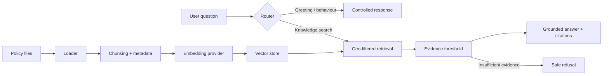

# Policy RAG Showcase

A compact, production-minded Retrieval-Augmented Generation (RAG) service for
answering geography-specific HR policy questions. It demonstrates the same
engineering concerns found in enterprise AI systems while remaining free and
easy to run locally.

## What this project demonstrates

- Markdown, text and PDF ingestion
- Metadata-aware word-overlap chunking
- Swappable embedding-provider interface
- In-memory vector search with cosine similarity
- Geography filters and source citations
- Deterministic routing for greetings and bot-behaviour questions
- Evidence threshold and safe "I don't know" behaviour
- FastAPI request validation and interactive API documentation
- Unit tests, Docker packaging and GitHub Actions CI

> **Design note:** the default `LocalHashEmbeddingProvider` is a transparent,
> dependency-free retrieval baseline—not a claim that hashing replaces a
> production semantic embedding model. The `EmbeddingProvider` interface is the
> extension point for OpenAI, Bedrock, Sentence Transformers or another model.

## Architecture



## Quick start

```bash
python3 -m venv .venv
source .venv/bin/activate
pip install -r requirements-dev.txt
uvicorn app.main:app --reload
```

Open `http://127.0.0.1:8000/docs` and try:

```json
{
  "query": "How much annual leave do employees receive?",
  "geo": "India",
  "top_k": 3,
  "debug": true
}
```

Expected answer evidence includes `18 days` and cites the India policy. Compare
the same request with `"geo": "USA"` to see metadata filtering in action.

## Run tests

```bash
pytest -q
```

## Run with Docker

```bash
docker build -t policy-rag-showcase .
docker run --rm -p 8000:8000 policy-rag-showcase
```

## Key design decisions

1. **Route before retrieval:** simple greetings do not need an expensive RAG call.
2. **Filter before ranking:** geography metadata prevents cross-region policy leakage.
3. **Refuse without evidence:** a score threshold reduces unsupported answers.
4. **Cite every knowledge answer:** sources, chunk IDs and scores make retrieval debuggable.
5. **Use provider boundaries:** embeddings and storage can be replaced without rewriting the API.


